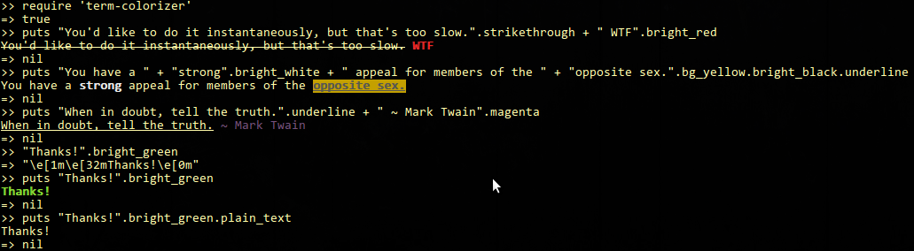
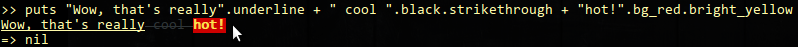

Term::Colorizer
===============

[](http://badge.fury.io/rb/term-colorizer)
[](https://travis-ci.org/vishaltelangre/term-colorizer)

Print colorized strings on terminal (Useful for printing fancy logs)

## Installation

Install gem by using following command:

    gem install term-colorizer

or add it to your Gemfile as:

```ruby
gem 'term-colorizer', require: 'term-colorizer'
```

## Usage

``` ruby
"Duck can quack".green
# => "\e[32mDuck can quack\e[0m"

puts "Wow, that's really".underline + " cool ".black.strikethrough + "hot!".bg_red.bright_yellow
# guess what it will do?
```

To see all accessible methods provided by term-colorizer, use:
```ruby
>> "Hello".term_colorizer_methods
=> [:black, :red, :green, :yellow, :blue, :magenta, :cyan, :white, :bright_black, :bright_red, :bright_green, :bright_yellow, :bright_blue, :bright_magenta, :bright_cyan, :bright_white, :bg_black, :bg_red, :bg_green, :bg_yellow, :bg_blue, :bg_magenta, :bg_cyan, :bg_white, :underline, :strikethrough, :term_colorizer_methods, :fancy_color_methods, :no_underline, :no_strikethrough, :no_color, :no_bg_color, :plain_text, :reset_fancyness]
```

## Screenshots



and, for sake:

```ruby
>> "That's it, boy!".green.bg_yellow.plain_text # resets fancy stuff
=> "That's it, boy!"
# look at above `term_colorizer_methods` for more such methods
```



:)

## Contributing

You're encouraged to contribute to this gem.

* Fork this project.
* Make changes, write tests.
* Report bugs, comment on and close open issues.
* Updated [CHANGELOG](CHANGELOG.md).
* Make a pull request, bonus points for topic branches.

## Copyright and License

Copyright (c) 2013, Vishal Telangre and [Contributors](CHANGELOG.md). All Rights Reserved.

This project is licenced under the [MIT License](LICENSE.md).
